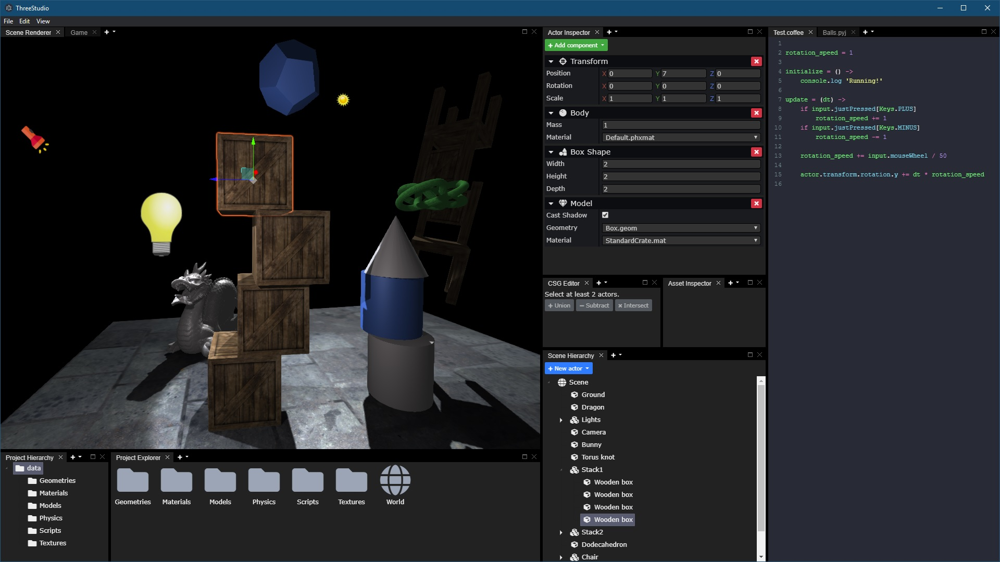

ThreeStudio
===========

### 3D game editor based on Three.js and Electron.



Aim of the project is to create a functional 3D editor using existing open-source web-based frameworks and libraries.
- Application: Node.js + Electron
- Core: HTML + CSS + JavaScript + jQuery
- Interface: jQuery UI + jsTree + GoldenLayout + CodeMirror + jscolor + Bootstrap + FontAwesome
- Rendering and physics: Three.js + ammo.js + csg.js
- Scripting: Esprima + CoffeeScript + RapydScript

#### Usage:

```
npm install
npm start
```

Press `F9` or `Ctrl+P` to enter/exit game mode.

To run the game in standalone mode:

```
npm start player
```
